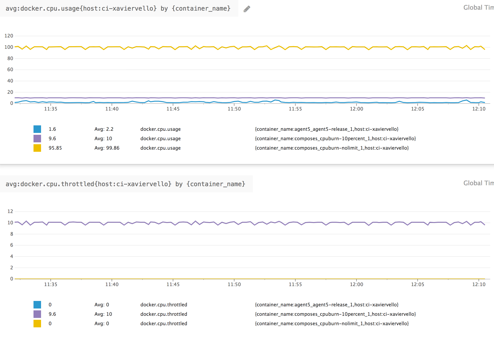

title: Docker operation pitfalls
class: animation-fade
layout: true

<!-- This slide will serve as the base layout for all your slides -->
.bottom-bar[
  {{title}}
]

---
class: impact
# {{title}}
## A Datadog Brownbag
---
class: spacey
# Agenda

Sharing tips and pitfalls from my experience running test clusters <br>and supporting users

- What's really a container?
- What should I monitor?
  - CPU
  - Memory
  - Network
  - Disk
  - Orchestrator stats
---
class: spacey
# What's a container?

.big[- It's a **process**
- And its **subprocesses**
- Isolated from the rest of the system
- With **containerization** technologies]
---
class: middle, center
count: false


---
# Regular process tree

```
systemd─┬─systemd───(sd-pam)
        ├─systemd-journal
        ├─systemd-logind
        ├─systemd-udevd
        ├─ ...
*       ├─redis-server───2*[{redis-server}]
        ├─ ...
*       ├─nginx───4*[nginx]
        ├─ ...
        │
```
---
# Dockerized process tree

```
systemd─┬─systemd───(sd-pam)
        ├─systemd-journal
        ├─systemd-logind
        ├─systemd-udevd
        ├─ ...
*       ├─dockerd─┬─docker-containerd─┬─redis-server───3*[{redis-server}]
*       │         │                   └─9*[{docker-containerd-shim}]
        │         ├─ ...
*       │         └─docker-containerd─┬─nginx───nginx
*       │                             └─9*[{docker-containerd-shim}]
        ├─ ...
        │
```
---

# So, what's the difference?

.col-6[
### Cgroups for<br>ressource allocation
- **cpu  cpuacct**
- **memory**
- blkio
- net_prio
- `$ ls /sys/fs/cgroup/` for more
]
--
.col-6[
### Namespaces<br>for isolation
- **mnt**
- **pid**
- **net**
- user
- `$ ls /proc/self/ns` for more
]
--

### These can be applied to regular processes
---
# `cpu` cgroup & CPU metrics

- Limit tells how much CPU cores a cgroup can use
- If limit exceeded, cgroup is **frozen** for a scheduling cycle ❄️
- Pretty unintrusive for your application
- **Can impact your application's performance**
- Must monitor `docker.cpu.throttled` to see if that happens
---
## Let's test it
```
version: '2.2'

services:
  cpuburn-nolimit:
    image: alpine:3.6
    command: "dd if=/dev/zero of=/dev/null"
  cpuburn-10percent:
    image: alpine:3.6
    command: "dd if=/dev/zero of=/dev/null"
*   cpus: 0.1
```
---
class: no-margin

.image-50[]
---
# `mem` cgroup & memory metrics

- Limit tells how much RAM / RAM+swap a cgroup can use
- If limit exceeded, ...
---
# `mem` cgroup & memory metrics

- Limit tells how much RAM / RAM+swap a cgroup can use
- If limit exceeded, [**oomkiller**](http://www.oracle.com/technetwork/articles/servers-storage-dev/oom-killer-1911807.html) descends upon your cgroup 💥
- Can kill the PID 1 (which leads to a OOM exit)
- Or not... which can leave the container **stuck in a non-working state** 🤷
- A common issue with docker-dd-agent (forwarder killed but collector still running)
- Must pre-emptively monitor `docker.mem.in_use` and `docker.mem.sw_in_use` to see if that could happen
---
## Let's test it
```
services:
  memleak-pid1:
    image: alpine:3.6
    command: "ash -c 'for i in `seq 1 10000000`; do true; done'"
*   mem_limit: 10000000
*   restart: on-failure
  memleak-forked:
    image: alpine:3.6
*   command: "ash -c \"ash -c 'for i in `seq 1 10000000`; do true; done'
*             & sleep 20\""
    cpus: 0.1
    mem_limit: 10000000
    restart: on-failure
```
---
```
ubuntu@ci-xaviervello:~$ docker-compose -f composes/memlimit.compose up
memleak-pid1_1    | Killed
composes_memleak-pid1_1 exited with code 137 💥
memleak-pid1_1    | Killed
...
memleak-forked_1  | Killed
memleak-pid1_1    | Killed
...
*composes_memleak-forked_1 exited with code 0 ✅
*composes_memleak-pid1_1 exited with code 137 💥
```

### What should I do?
- Run only one program per container (or use a robust supervisor)
- Have a relevant healthcheck
---
# `net` namespace & net metrics

- Every container has their own network namespace
- Their own virtual eth0 that has a private IP, bridged by the host
- Allows isolation and routing
- Allows us to collect per-container metrics

```
*$ docker exec agent5_agent5-release_1 cat /host/proc/30828/net/dev
Inter-|   Receive
 face |bytes    packets errs drop fifo frame compressed multicast
    lo: 6961740   50619    0    0    0     0          0         0
  eth0: 19558170   37932    0    0    0     0          0         0
  ```
---
```
*$ cat /proc/net/dev
Inter-|   Receive
 face |bytes    packets errs drop fifo frame compressed multicast
enp0s8: 61509004  104768    0    0    0     0          0         0
enp0s3: 523131054  862084    0    0    0     0          0         0
    lo:    2952      46    0    0    0     0          0         0
veth4642e27: 6763827   33666    0    0    0     0          0         0
...

*$ docker exec agent5_agent5-release_1 cat /proc/net/dev
Inter-|   Receive
 face |bytes    packets errs drop fifo frame compressed multicast
    lo: 6656783   48403    0    0    0     0          0         0
  eth0: 18699348   36269    0    0    0     0          0         0
```
---
```
*$ docker exec agent5_agent5-release_1 cat /host/proc/net/dev
```
--
```
Inter-|   Receive
 face |bytes    packets errs drop fifo frame compressed multicast
    lo: 6697512   48702    0    0    0     0          0         0
  eth0: 18812503   36489    0    0    0     0          0         0
```
--
### How to get the host's metrics?
- Run `docker-dd-agent` with `net=host`
---
### Investigating using `/host/proc/1/net/dev` in agent6

```
*$ docker exec agent5_agent5-release_1 cat /proc/1/net/dev
Inter-|   Receive
 face |bytes    packets errs drop fifo frame compressed multicast
    lo: 6882233   50038    0    0    0     0          0         0
  eth0: 19332873   37499    0    0    0     0          0         0

*$ docker exec agent5_agent5-release_1 cat /host/proc/1/net/dev
Inter-|   Receive
 face |bytes    packets errs drop fifo frame compressed multicast
enp0s8: 61509280  104771    0    0    0     0          0         0
enp0s3: 523996193  864400    0    0    0     0          0         0
    lo:    2952      46    0    0    0     0          0         0
veth4642e27: 7017324   34939    0    0    0     0          0         0
```
---
# `mnt` namespace & disk metrics

- By default, containers don't have access to the host's filesystem (duh!)
- Free space is a property of the filesystem, not the block device
- To get metrics on a filesystem, you need to bind it in the container, [see KB](https://help.datadoghq.com/hc/en-us/articles/115001786703-How-to-report-host-disk-metrics-when-dd-agent-runs-in-a-docker-container-)

### Please monitor free space in `/var/lib/docker`!
```
*$ docker system df
TYPE                TOTAL       ACTIVE      SIZE        RECLAIMABLE
Images              51          6           4.52GB      3.946GB (87%)
Containers          13          2           125MB       73.74MB (58%)
Local Volumes       47          3           1.05kB      1.05kB (100%)
```
---
# Orchestrator metrics

- [https://www.datadoghq.com/blog/monitor-kubernetes-docker/](https://www.datadoghq.com/blog/monitor-kubernetes-docker/)
- `mesos-master` and `mesos-slave`
- `kubernetes`, `kubernetes_state`

###Alert on high level objects (deployments, daemonsets, tasks...), drill down to the container-level for investigation

---
class: middle

# .big[Questions?]

---

# .big[Thanks!]

Get it at github.com/**xvello/decks**/tree/master/201711-datadog-brownbag/pdf

# Next week

.big[- Aaditya Talwai
- Team Raclette
- APM intake/storage/query pipeline]
