title: Container monitoring challenges &ndash; Xavier Vello &ndash; Datadog
class: animation-fade
layout: true


<!-- TODO
- agent parts schema
- test memlimit compose
 -->


<!-- This slide will serve as the base layout for all your slides -->
.bottom-bar[
  {{title}}
]

---
class: impact
background-image: url(images/title_background.png)


# Container monitoring challenges
## Xavier Vello - Datadog

---

# `whois xvello.net`

.col-3[

]
.col-1[
&nbsp;
]
.col-8[
- Former Debian Maintainer

- (sporadic) KDE contributor

- Industrial Engineer for 5 years

- Software Engineer at Datadog

- Container Monitoring Team
]
.right[xavier.vello@datadoghq.com

http://lkdin.com/in/xaviervello]
---
class: responsive
# `whois datadoghq.com`
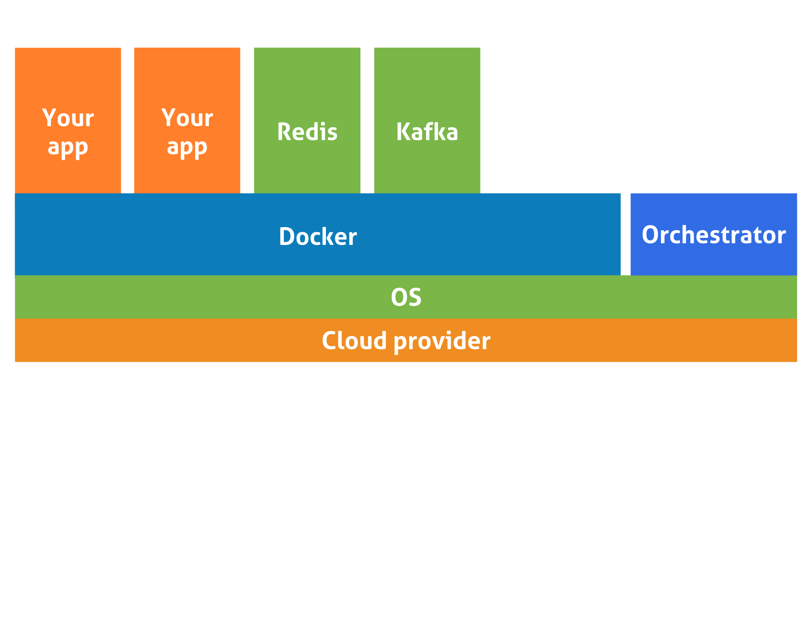

???

- Here's your stack
- Lots of moving pieces
- How to get a complete view of it?
---
class: responsive
count: false

# `whois datadoghq.com`
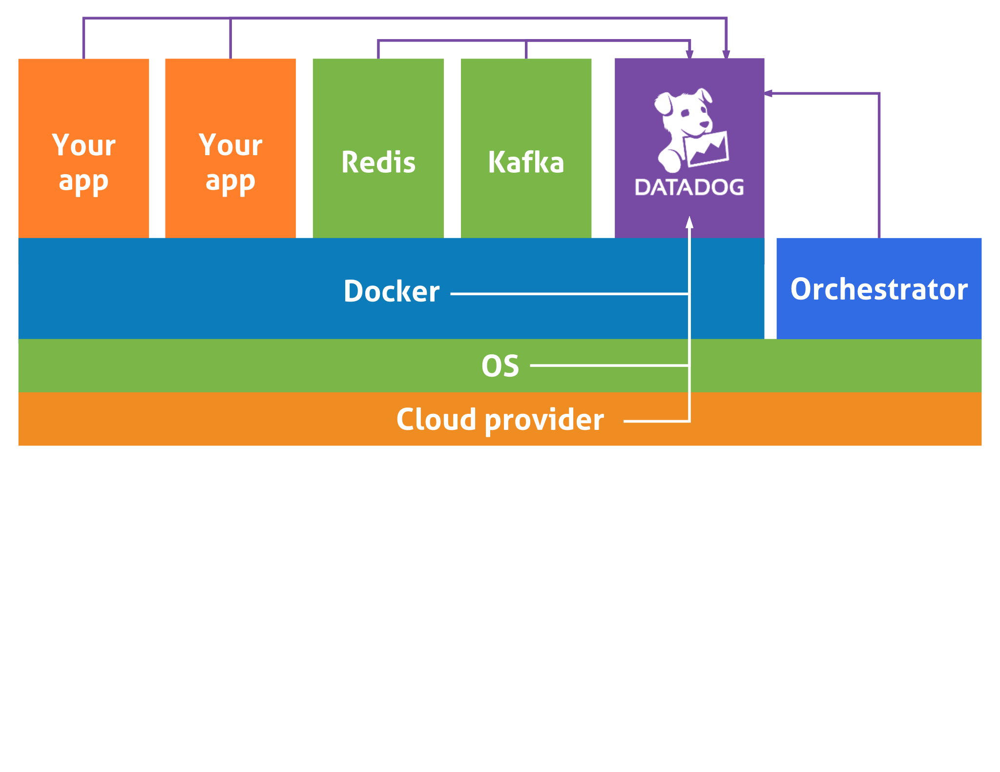

???

- Deploy the agent in your cluster
- We collect data and metadata
- We give you a unique entrypoint to monitor everything
- We integrate with more than 200 technologies

---
class: responsive no-padding
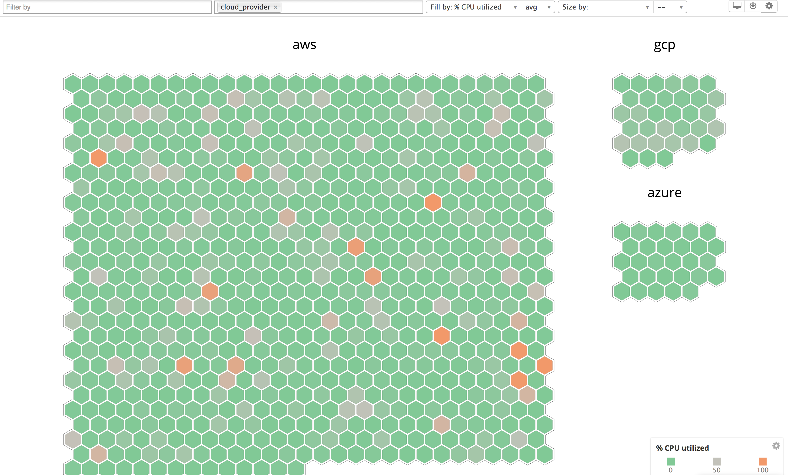

???

We give you a synthetic view (very quick slideshow)
---
class: responsive no-padding
count: false
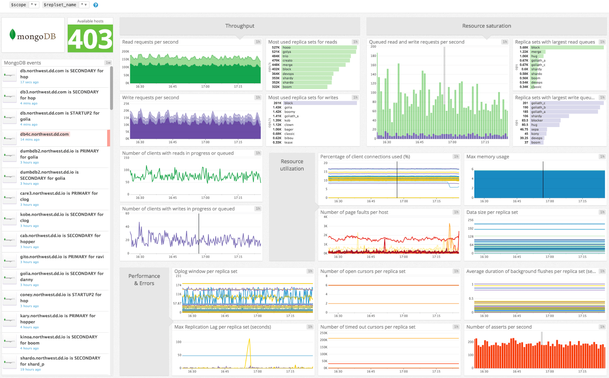

???

Dashboards
---
class: responsive no-padding
count: false
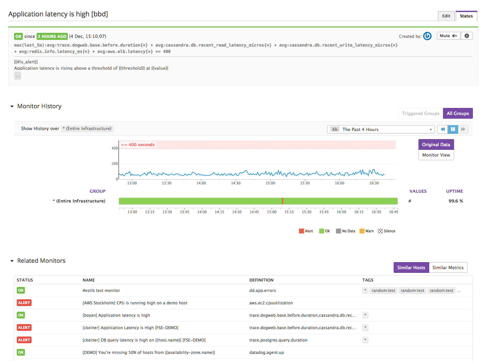

???

Alerts
---
class: responsive no-padding
count: false
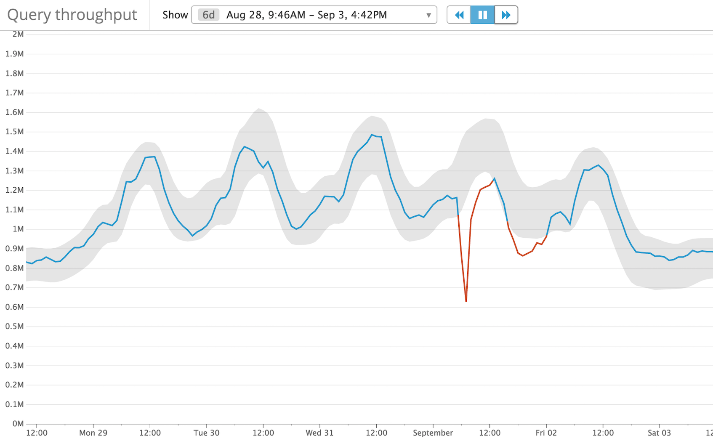

???

based on machine learning
---
class: responsive no-padding
count: false
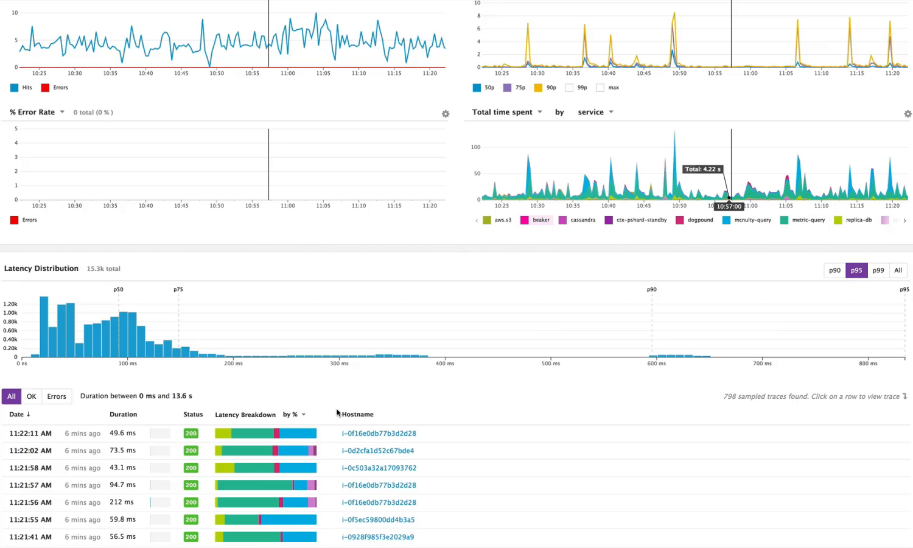

???

Application Performance Monitoring
---
class: responsive no-padding
count: false
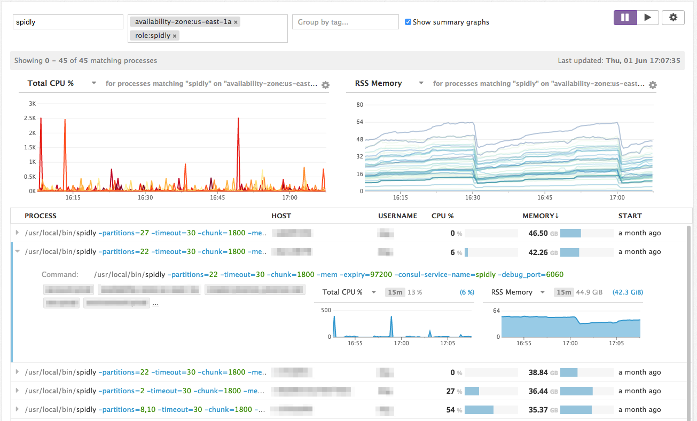


???

An now also: real-time process monitoring
---
class: responsive no-padding
count: false
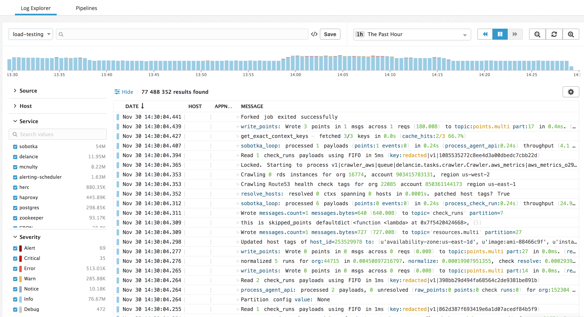

???

And logs too

Come to our booth for a demo or a chat
---
class: width90

# Our collection agent

A 7 year-old codebase, **24 458 Python SLOCs**


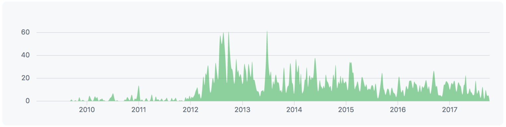

87 integrations (**32 274 Python SLOCs**) in a different repo

???

Most of my work is on the collection agent that clients
install on their hosts.

Our current agent has served us well, but:

- its core is host-centric
- its performance was limited by Python's concurrency model

---
# The Agent6 project

## A rewrite

- With **containers** support from the start
- With **Autodiscovery** at the core

--

## A rewrite in Go

- **Reduce** memory and CPU usage
- **Better** reliability and maintainability
- True **concurrency**

---

# Agenda

###**Share our challenges and discoveries:**

- ### Namespaces & cgroups

- ### DogStatsD traffic: using Unix Domain Sockets

- ### Secure usage of the Docker Socket?

???

Goal of this talk is to share some work we have done,
and some currently ongoing work.

---
class: impact
background-image: url(images/title_background.png)

# Namespaces<br/>& cgroups

## "The dead forwarder" case of 2017
## Network metrics

???
I could do a whole talk on it, but already one this morning

I want to highlight two cases
<!--
- - -
# Regular process tree

```
systemd─┬─systemd───(sd-pam)
        ├─systemd-journal
        ├─systemd-logind
        ├─systemd-udevd
        ├─ ...
*       ├─redis-server───2*[{redis-server}]
        ├─ ...
*       ├─nginx───4*[nginx]
        ├─ ...
        │
```

???

When explaining containers to my colleagues, I like to start with the process tree. This is the process tree of a regular server running nginx and redis
- - -
# Dockerized process tree

```
systemd─┬─systemd───(sd-pam)
        ├─systemd-journal
        ├─systemd-logind
        ├─systemd-udevd
        ├─ ...
*       ├─dockerd─┬─docker-containerd─┬─redis-server───3*[{redis-server}]
*       │         │                   └─9*[{docker-containerd-shim}]
        │         ├─ ...
*       │         └─docker-containerd─┬─nginx───nginx
*       │                             └─9*[{docker-containerd-shim}]
        ├─ ...
        │
```

???

And here it is when running them in docker containers.

Not much is changed, how does Docker isolate your containers?
- - -

# So, what's the difference?

.col-6[
### Cgroups for<br>ressource allocation
- **cpu  cpuacct**
- **memory**
- blkio
- net_prio
- see `$ ls /sys/fs/cgroup/`
]
- -
.col-6[
### Namespaces<br>for isolation
- **mnt**
- **pid**
- **net**
- user
- see `$ ls /proc/self/ns`
]
- -

Can be applied to regular processes: `systemd-nspawn`

???

These are kernel primitives, that Docker uses
- - -
# `cpu` cgroup

- Limit tells how much CPU cores a cgroup can use

- If limit exceeded, cgroup is **frozen** for a scheduling cycle

- Pretty unintrusive for your application

- **Can impact your application's performance**

- Must monitor `docker.cpu.throttled` to see if that happens
-->

---
class: width90

# "The dead forwarder" case

```
  supervisord supervisord -n -c /etc/dd-agent/supervisor.conf
    │
    ├─python agent.py foreground --use-local-forwarder
    │   └─{python}
    ├─python dogstatsd.py --use-local-forwarder
    │   └─{python}
    └─python ddagent.py
```

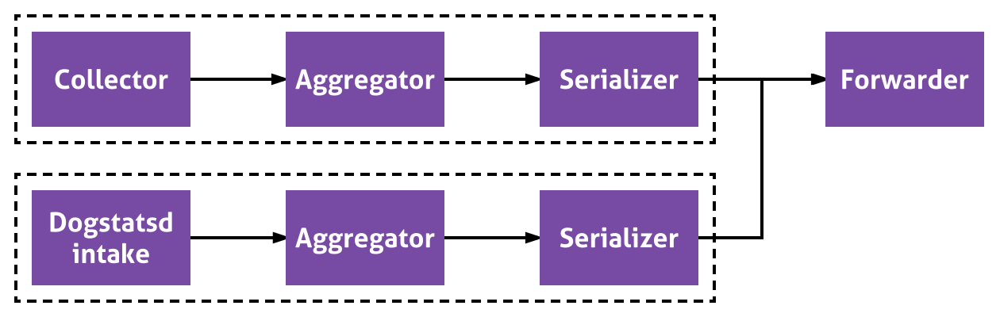


???

To scale accross cores, we split the Python agent in 3 processes

---

# "The dead forwarder" case

- Support case: "metrics not coming through although the collection works OK"

--

- Collector logs: errors connecting to `localhost:17123`


--

- Supervisord logs: unexpected `exit` of the forwarder, retries 5 times then gives up

--

- Forwarder logs: `no error`


---
class: width90

# `docker-dd-agent` process tree

```
  supervisord supervisord -n -c /etc/dd-agent/supervisor.conf
    │
    ├─python agent.py foreground --use-local-forwarder
    │   └─{python}
    ├─python dogstatsd.py --use-local-forwarder
    │   └─{python}
    └─python ddagent.py
```

???

To scale accross cores, we split the Python agent in 3 processes
---
count:false
class: width90

# `docker-dd-agent` process tree

```
  supervisord supervisord -n -c /etc/dd-agent/supervisor.conf
    │
    ├─python agent.py foreground --use-local-forwarder
    │   └─{python}
    ├─python dogstatsd.py --use-local-forwarder
    │   └─{python}
*   └─
```

---

# `mem` cgroup

- Limit tells how much RAM / RAM+swap a cgroup can use

- If limit exceeded, ...
---
count: false
# `mem` cgroup

- Limit tells how much RAM / RAM+swap a cgroup can use

- If limit exceeded, **oomkiller** descends upon your cgroup

  - Can kill the PID 1 (which leads to a container OOM exit)

  - Or not... which can leave the container **stuck in a<br/>non-working state** 🤷

- Must pre-emptively monitor `docker.mem.in_use` and `docker.mem.sw_in_use` to see if that could happen
---
# Let's test it
```
services:
  memleak-pid1:
    image: alpine:3.6
    command: "ash -c 'for i in `seq 1 10000000`; do true; done'"
*   mem_limit: 10000000
*   restart: on-failure
  memleak-forked:
    image: alpine:3.6
*   command: "ash -c \"ash -c 'for i in `seq 1 10000000`; do true; done'
*             & sleep 20\""
    mem_limit: 10000000
    restart: on-failure
```
---

# Result
```
ubuntu@ci-xaviervello:~$ docker-compose -f composes/memlimit.compose up
memleak-pid1_1    | Killed
composes_memleak-pid1_1 exited with code 137 💥
memleak-pid1_1    | Killed
memleak-forked_1  | Killed
...
*composes_memleak-forked_1 exited with code 0 ✅
*composes_memleak-pid1_1 exited with code 137 💥
```
--
# What should I do?
- Ideally, run only one program per container
- Or use a robust supervisor, check exit codes
- Have a thorough healthcheck

???

Supervisord does not retrive children exit codes...

---
# `net` namespace

- Every container has their own network namespace

- Their own virtual `eth0` that is bridged by the host

- Allows isolation and routing

- Allows us to collect per-container metrics

```
*$ docker exec agent5 cat /host/proc/30828/net/dev
Inter-|
 face | bytes       packets  errs drop fifo frame compressed multicast
    lo: 6961740     50619    0    0    0     0          0         0
  eth0: 19558170    37932    0    0    0     0          0         0
  ```
---
# Getting the host's net stats
```
*$ cat /proc/net/dev
Inter-|
 face | bytes      packets   errs drop fifo frame compressed multicast
enp0s8: 61509004   104768    0    0    0     0          0         0
enp0s3: 523131054  862084    0    0    0     0          0         0
    lo: 2952       46    0   0    0     0          0         0
...
```
```
*$ docker exec agent5 cat /proc/net/dev
Inter-|
 face | bytes      packets  errs drop fifo frame compressed multicast
    lo: 6656783    48403    0    0    0     0          0         0
  eth0: 18699348   36269    0    0    0     0          0         0
```
---
# Getting the host's net stats

```
*$ docker exec agent5 cat /host/proc/net/dev
```
--
```
Inter-|
 face | bytes      packets  errs drop fifo frame compressed multicast
    lo: 6697512    48702    0    0    0     0          0         0
  eth0: 18812503   36489    0    0    0     0          0         0
```
--
- We need to run with `net=host` 😞
--

- Investigating monitoring `pid 1`'s net stats

```
*$ docker exec agent5 cat /host/proc/1/net/dev
Inter-|
 face | bytes      packets   errs drop fifo frame compressed multicast
enp0s8: 61509280   104771    0    0    0     0          0         0
enp0s3: 523996193  864400    0    0    0     0          0         0
    lo: 2952       46        0    0    0     0          0         0
...
```
---
class: impact
background-image: url(images/title_background.png)

# DogStatsD traffic:<br/> using<br/> Unix Domain Sockets

---
class: responsive
# What is DogStatsd?

Collection, tagging, aggregation of your custom metrics

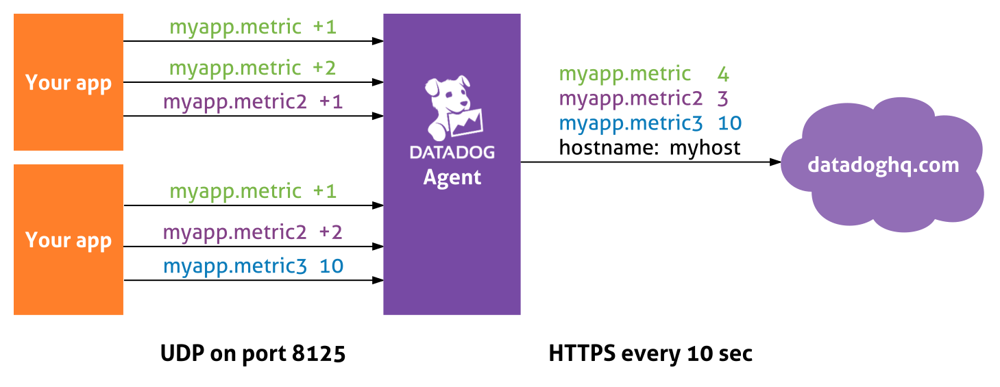

---
class: bigtext

# Issues with UDP

- Poor **discoverability** of the endpoint

- No error handling makes **automatic detection** impossible

- **Network overhead** (lots of small UDP packets)

- Detecting **source container** per IP is error-prone

???

Traffic needs to stay host-local for hostname and aggregation to be OK, no LB
---
class: center

#So, we're just trying to <br/>talk to `localhost`, right?


---

class: width70
# Datagram Unix Sockets

- Host-local traffic
- Same semantics as UDP
- Smaller CPU overhead than iptables
- Endpoint is a **socket file in a docker volume**
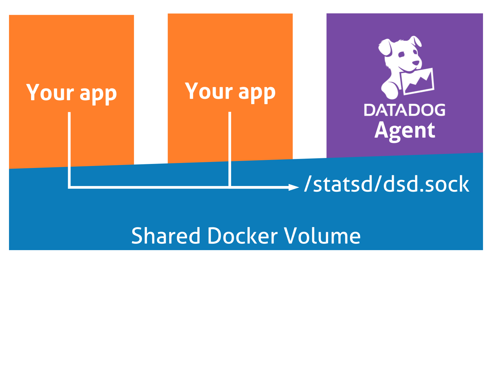

---

# Container tagging is easy!

```go
unix.SetsockoptInt(fd, unix.SOL_SOCKET, unix.SO_PASSCRED, 1)
```
Unix Credentials in anciallary data, provided by the kernel

```go
type Ucred struct {
*   Pid int32
    Uid uint32
    Gid uint32
}
```

Need to run in `pid=host` mode
---

# Container tagging is easy!

You can slice and compare your custom metrics by:
- Availability zone
- Host
- Chef role

as before, but also now by:

- **ECS task**

- **Kubernetes deployment**

- **Docker labels**

---

class: impact
background-image: url(images/title_background.png)

# Secure usage of<br/>the Docker Socket?

---

# Secure Docker Socket?

### Monitoring is intrusive, but we strive to make it secure and seamless

--

- We need to list and inspect containers, images, volumes

- Docker does not provide a **monitoring interface**

- It provides **monitoring endpoints** in its **management interface**

???

This access could be used by an attacker for privilege escalation
---
class: responsive
# Plan A: use AuthN and AuthZ

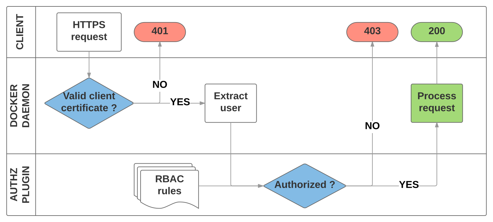
---
# Plan A: use AuthN and AuthZ

## Pros:
- Already upstream since 1.11
- Solid authentication mechanism
- Similar to the Kubernetes AuthN/AuthZ system

--

## Cons:
- Need to setup a PKI
- Requires a third-party AuthZ plugin
- `/var/run/docker.sock` unusable (it's HTTP-only for now)

---
class: responsive
# Plan A: use AuthN and AuthZ

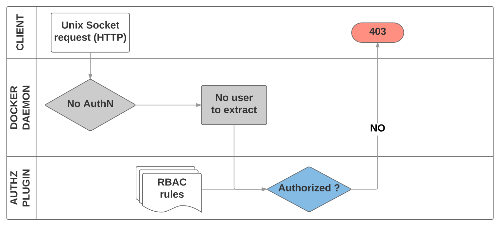
---
# Plan B1: HTTPS on UDS

## Pros:
- Minimal changes in Moby

--

## Cons:
- Still need to setup a PKI

- **Still breaks most orchestrators**

---
class: responsive
# Plan B2: use UID for AuthZ


---
# Plan B2: use UID for AuthZ

## Pros:
- Minimal changes

- No PKI

- Transparent to orchestrators (just whitelist `unix:root`)

--

## Cons:
- Linux-specific logic

- Different code path for AuthN

---

# Plan B2: use UID for AuthZ

## Great idea!
### Let's discuss it on:<br/>https://github.com/moby/moby/issues/35711
### RFC: enable AuthZ on the unix socket

--

## Wait! 😿
- ECS ships `1.12`
- GKE ships `1.13`

???

- How do we support these Docker versions?

---
class: responsive
# Plan C: use a filtering proxy

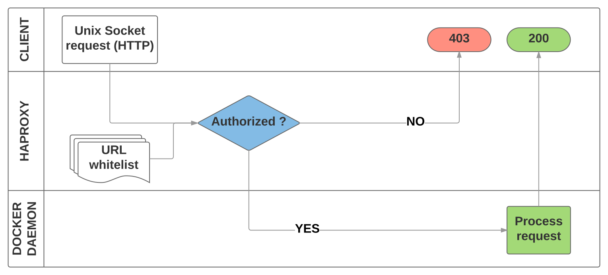

---

# Plan C: use a filtering proxy

```yaml
services:
  dockerproxy:
*   image: "datadog/docker-filter"
    volumes:
      - /var/run/docker.sock:/var/run/docker.sock:ro
*     - safe-socket:/safe-socket:rw
    network_mode: "none"

  agent5:
    image: "datadog/docker-dd-agent:latest"
    volumes:
*     - safe-socket:/var/run:ro
      - /proc/:/host/proc/:ro
      - /sys/fs/cgroup/:/host/sys/fs/cgroup:ro
```
---
class: impact
background-image: url(images/title_background.png)

# Thanks!
# Questions?

.center[&nbsp;
##xavier.vello@datadoghq.com]
---
class: impact
background-image: url(images/title_background.png)


# We are hiring!
## Paris, NYC, Remote

## http://jobs.datadoghq.com


