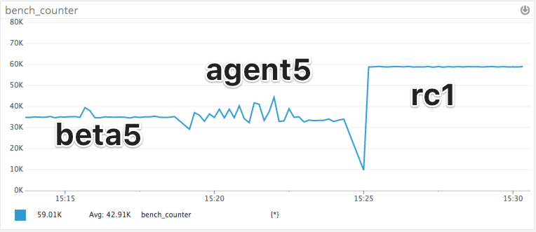

# How I (almost) doubled dogstatsd's throughput in 5 PRs

Dogstatsd listens to UDP / UDS traffic and parses a text procotol to ingest custom metrics from the user's applications. These metrics then follow the common aggregator -> serializer -> forwarder pipeline to be submitted to our backend.


We have some users with a very heavy usage of DSD, that sent enough traffic to cause DSD to drop packets and drop data on the floor. Limitations of agent5:

  - single-threaded python intake loop
  - full-Python payload parsing logic with sub-obtimal memory management

We hoped to see a significant improvement in dsd6 by:

  - using Go instead of Python for intake, parsing and aggregation
  - running a multithreaded intake logic, to scale better over several CPUs and absorb spikes

## Beta5 benchmarks

In november 2017, we benchmarked Dogstatsd 5.20.0 vs Dogstatsd 6.0.0.beta.5, on a quad-core VM, with UDP data sent from another VM (to reduce the impact of high-frequency context switches between sender and listener).

|        | 5.20.0             | 6.0.0.beta.5                |
|--------|--------------------|-----------------------------|
| Rate   | 26K pps            | **33.7K pps**               |
| CPU    | 100% (single core) | ~150% (over multiple cores) |
| Memory | 0.6%               | 0.4%                        |

As expected, DSD6 is able to scale accross multiple cores, but:
  - its performance-per-core is lower than DSD5's (22.4k pps/core instead of 26)
  - we plateau at 33.7k pps while **neither the cpu not the network are maxed out**

This limitation is confirmed by the traffic drop test, measuring at which throughput we detect the first packet drop:

|        | 5.20.0             | 6.0.0.beta.5               |
|--------|--------------------|----------------------------|
| Rate   | 18K pps            | **17K pps**                |
| CPU    | ~55% (single core) | ~85% (over multiple cores) |
| Memory | 0.6%               | 0.4%                       |

We see we start loosing packets even before saturating one core, and at the same order of magnitude as DSD5. Furthermore, we use more CPU than DSD5 to do the same task.

**Benchmarking and optimization were needed to bring the customer value we wanted to deliver in DSD6.**

## Premature optimization is the root of all evil

Several causes for this

- most of the devs learned Go while contributing to the Agent6 project, lots of non-idiomatic code
- young, fast-moving codebase, new features (origin detection, percentiles), and future challenges (cardinality) that required us to keep wiggle-room

Prematurely optimizing this codebase would probably have been counter-productive, by:

- spending time on code that might be thrown away in a month
- making the addition of new features harder

Once the feature set was stable, we could start working on performance

## Measure, measure again and measure some more

### Go expvars

JSON payload exposed on `http://localhost:5000/debug/vars`. Can retrieve common stats and [custom information](https://golang.org/pkg/expvar/). One of the common stats is [`memstats`](https://golang.org/pkg/runtime/#MemStats)

Of course, [there's a Datadog integration for that](https://docs.datadoghq.com/integrations/go_expvar/)!

[Example goexpvar output of 6.0.0.rc.1](goexpvar.json)

### PProf and trace

Allows in-place profiling of an application, either by:

- [programatically profiling from inside your application](https://golang.org/pkg/runtime/pprof/#StartCPUProfile)
- [exposing an http endpoint](https://golang.org/pkg/net/http/pprof/), and getting traces on a per-needed basis

The second one is great for profiling on remote systems. You can then copy the file and analyse it locally. Current endpoints:

- http://localhost:6060/debug/pprof/heap
- http://localhost:6060/debug/pprof/profile
- http://localhost:6060/debug/pprof/trace?seconds=5

- http://localhost:6060/debug/pprof/block (requires `runtime.SetBlockProfileRate`)
- http://localhost:6060/debug/pprof/mutex (requires `runtime.SetMutexProfileFraction`)

`go tool` bundles a very powerful execution tracer, see [justforfunc #22: using the Go execution tracer](https://www.youtube.com/watch?v=ySy3sR1LFCQ)

### Benchmarks

The go testing framework also supports benchmarking out of the box, to benchmark:

- execution time
- allocation number and size
- exporting heap / cpu profiles for use with pprof

See examples below

## Initial investigations (beta5 -> beta6)

### Garbage collector stats

```sh
curl -s http://localhost:5000/debug/vars | jq '.memstats.GCCPUFraction'
0.15341308345347093
```
We spent more than 15% of our CPU time running the garbage collector. **During these pauses our reception buffer fills up and we can drop packets.**

### [CPU profiling](pprofs/beta5/profile.svg)

In the hottest paths in red:

```
$ go tool pprof profile
(pprof) top -cum 15
Showing nodes accounting for 3.22s, 16.18% of 19.90s total
Dropped 206 nodes (cum <= 0.10s)
Showing top 15 nodes out of 146
      flat  flat%   sum%        cum   cum%
     0.20s  1.01%  1.01%      6.22s 31.26%  runtime.systemstack
     0.06s   0.3%  1.31%      3.76s 18.89%  github.com/DataDog/datadog-agent/pkg/dogstatsd/listeners.(*UDPListener).Listen
         0     0%  1.31%      3.40s 17.09%  runtime.gcBgMarkWorker
     0.48s  2.41%  3.72%      3.31s 16.63%  runtime.gentraceback
     0.06s   0.3%  4.02%      3.25s 16.33%  github.com/DataDog/datadog-agent/pkg/aggregator.(*BufferedAggregator).run
     0.01s  0.05%  4.07%      3.17s 15.93%  runtime.morestack
     0.04s   0.2%  4.27%      3.16s 15.88%  runtime.newstack
     1.67s  8.39% 12.66%      3.08s 15.48%  runtime.scanobject
     0.02s   0.1% 12.76%      3.06s 15.38%  runtime.copystack
     0.15s  0.75% 13.52%         3s 15.08%  runtime.gcDrain
         0     0% 13.52%      2.98s 14.97%  runtime.gcBgMarkWorker.func2
     0.41s  2.06% 15.58%      2.74s 13.77%  runtime.mallocgc
     0.06s   0.3% 15.88%      2.54s 12.76%  github.com/DataDog/datadog-agent/pkg/dogstatsd.(*Server).handleMessages.func1
     0.02s   0.1% 15.98%      2.21s 11.11%  net.(*UDPConn).ReadFrom
     0.04s   0.2% 16.18%      2.19s 11.01%  net.(*UDPConn).readFrom
```

On our test 30 seconds CPU profile we are spending roughly:

- 19% in the UDP intake (`UDPListener.Listen`)
- 16% in the aggregator (`BufferedAggregator.Run`)
- **16% spawning goroutines (`runtime.newstack`)**
- **15% in the GC (`runtime.gcDrain`)**
- **14% allocating heap memory (`runtime.mallocgc`)**
- 12% parsing messages (`Server.handleMessages.func1`)
- 8% on other things

### [Heap profiling](pprofs/beta5/heap.svg)

```
$ go tool pprof -alloc_space heap
(pprof) top
Showing nodes accounting for 12.98GB, 98.82% of 13.13GB total
Dropped 183 nodes (cum <= 0.07GB)
Showing top 10 nodes out of 19
      flat  flat%   sum%        cum   cum%
   12.05GB 91.76% 91.76%    12.16GB 92.60%  github.com/DataDog/datadog-agent/pkg/dogstatsd/listeners.(*UDPListener).Listen
    0.29GB  2.22% 93.98%     0.29GB  2.22%  bytes.genSplit
    0.18GB  1.34% 95.33%     0.44GB  3.37%  github.com/DataDog/datadog-agent/pkg/dogstatsd.parseMetricPacket
    0.16GB  1.20% 96.53%     0.16GB  1.20%  bytes.NewBuffer (inline)
    0.08GB  0.58% 97.11%     0.08GB  0.58%  github.com/DataDog/datadog-agent/vendor/github.com/cihub/seelog.newLogFormattedMessage (inline)
    0.07GB  0.52% 97.63%     0.11GB  0.84%  net.(*UDPConn).readFrom
    0.06GB  0.49% 98.12%     0.14GB  1.07%  github.com/DataDog/datadog-agent/pkg/dogstatsd.(*Server).handleMessages
    0.05GB  0.36% 98.48%     0.29GB  2.19%  github.com/DataDog/datadog-agent/pkg/aggregator.generateContextKey
    0.04GB  0.34% 98.82%     0.09GB  0.69%  github.com/DataDog/datadog-agent/pkg/dogstatsd.parseTags
         0     0% 98.82%     0.22GB  1.69%  bytes.Split
```

Several flags are useful:

| pprof flag     | Usage                                              |
|----------------|----------------------------------------------------|
| -inuse_space   | **Current** heap use, in total size                |
| -inuse_objects | **Current** heap use, in object count              |
| -alloc_space   | **Total allocations** since start, in size         |
| -alloc_objects | **Total allocations** since start, in object count |

Alloc size influences the **frequency** of the GC runs, alloc count influences the **runtime** of the GC runs (more work to do). Both are to be looked at.

### [#928 [dsd] reduce heap allocations in listeners](https://github.com/DataDog/datadog-agent/pull/928)

We used to allocate a 8kB buffer for every incoming UDP/UDS packet, then garbage-collect it when parsed. When receiving thousands of packets/sec that accounted to several MB/s of heap trash being generated.

This PR uses the [sync.Pool](https://golang.org/pkg/sync/#Pool) shared object pool to reuse Packet objects instead of allocating new ones everytime. This will help with scaling to higher throughputs.


```go
 type Packet struct {
	buffer   []byte // Underlying buffer for data read
 	Contents []byte // Contents, might contain several messages (slice from buffer)
 	Origin   string // Origin container if identified
 }
```

As indicated in the PacketPool comment:

> Caution: as objects get reused, byte slices extracted from packet.Contents will change when the object is reused. You need to hold on to the object until you extracted all the information and parsed it into strings/float/int.

I audited `parse.go` and confirmed we are not bleeding out any naked []byte that would be affected by that. We release the Packet object after parsing it entirely.

## Going further (beta6 -> beta7)

beta6 performance:

- `memstats.GCCPUFraction ` : 1,37%
- [CPU profiling](pprofs/beta6/profile.svg): `runtime.gcDrain` down to 1.78% , `runtime.mallocgc` is still 8% -> need to keep working on allocations
- [Alloc-space](pprofs/beta6/heap.svg): two main causes identified:
  - `dogstatsd.parseMetricMessage` / `bytes.Split`
  - `aggregator.run` / `generateContextKey`

### [#950 [agg] move contextKeys to 128bit Murmur3 hashes](https://github.com/DataDog/datadog-agent/pull/950)

Tackling the `generateContextKey` memory allocations. It generates a string aggregation of metric name + tags + hostname, for example ``my.metric.name,bar,foo,metric-hostname``. It was called for every metric coming into the aggregator.

#### [Benchmark current code](bench/contextkeys/current_test.go)

```
$ go test -bench=BenchmarkCurrent -benchmem ./bench/contextkeys/
goos: darwin
goarch: amd64
BenchmarkCurrent-4   	 3000000	       422 ns/op	     560 B/op	       4 allocs/op
PASS
ok  	_/Users/xaviervello/git/decks/201802-internal-dsd-optim/bench/contextkeys	1.766s
```

We can go down to the line number triggering the allocation:

```
$ go test -bench=BenchmarkCurrent -memprofile=mem ./bench/contextkeys/
$ go tool pprof --top   --alloc_objects --lines mem
Main binary filename not available.
Type: alloc_objects
Time: Feb 21, 2018 at 4:11pm (CET)
Showing nodes accounting for 15925594, 100% of 15925610 total
Dropped 13 nodes (cum <= 79628)
      flat  flat%
   4185388 26.28%  bytes.NewBuffer /usr/local/Cellar/go/1.10/libexec/src/bytes/buffer.go:449 (inline)
   4081685 25.63%  _/Users/xaviervello/git/decks/201802-internal-dsd-optim/bench/contextkeys.generateContextKey /Users/xaviervello/git/decks/201802-internal-dsd-optim/bench/contextkeys/current_test.go:20
   3922855 24.63%  bytes.(*Buffer).String /usr/local/Cellar/go/1.10/libexec/src/bytes/buffer.go:66 (inline)
   3735666 23.46%  sort.Strings /usr/local/Cellar/go/1.10/libexec/src/sort/sort.go:314
```

We find the 4 allocations:

  - `bytes.NewBuffer`
  - `make([]byte, 0, bufferSize)`
  - `sort.Strings(metricSample.Tags)`
  - `return buffer.String()`

Now we just need to avoid them ;)

- Use [mmh3 128bit hash for a non-alloc hashing](bench/contextkeys/mmh3_test.go), used in our backend systems, still two allocs
- Reuse hasher in a `sync.Pool` to avoid one allocation
- Sort tags with [in-place selection sort](bench/contextkeys/common.go)

```
$ go test -bench=. -benchmem ./bench/contextkeys/
goos: darwin
goarch: amd64
BenchmarkCurrent-4                       	 548 ns/op	     560 B/op	       4 allocs/op
BenchmarkHandle-4                        	 835 ns/op	      80 B/op	       2 allocs/op
BenchmarkHandleReuse-4                   	 856 ns/op	      32 B/op	       1 allocs/op
BenchmarkHandleReuseNoIface-4            	 375 ns/op	      32 B/op	       1 allocs/op
BenchmarkHandleReuseNoIfaceBubble-4      	 410 ns/op	       0 B/op	       0 allocs/op
BenchmarkHandleReuseNoIfaceSelection-4   	 303 ns/op	       0 B/op	       0 allocs/op
```

Great side-effect: we are **30% faster on context lookups** than before (see PR for all details).

### [#951 [dsd] optimize parsing logic for performance](https://github.com/DataDog/datadog-agent/pull/951)

[I continued profiling pkg/dogstatsd to reduce heap allocations and CPU usage](bench/parsing). Most of the work is removing bytes.Split occurrences that allocated useless `[][]bytes`, and directly tokenkize the input `[]byte`. The remaining allocations are individual `string` and `[]string` that can't be avoided by design.

```
$ go test -bench=. -benchmem ../../bench/parsing

BenchmarkNextMessageCurrent-4     	 508 ns/op	     272 B/op	       5 allocs/op
BenchmarkNextMessageScanner-4     	1662 ns/op	    4224 B/op	       3 allocs/op
BenchmarkNextMessageScanLines-4   	 108 ns/op	      80 B/op	       1 allocs/op

BenchmarkParseMetricCurrent-4     	 798 ns/op	     328 B/op	       8 allocs/op
BenchmarkParseMetricSplit2-4      	 362 ns/op	     200 B/op	       5 allocs/op

BenchmarkParseTagsCurrent-4       	 398 ns/op	     160 B/op	       5 allocs/op
BenchmarkParseTagsSplit2-4        	 319 ns/op	      80 B/op	       4 allocs/op
```

### [#952 [dsd] use a fixed number of parsing workers](https://github.com/DataDog/datadog-agent/pull/952)

Back to [CPU profiling](pprofs/beta6/profile.svg): `runtime.newstack` was more than 20% of the CPU time: that's the goroutine spawning cost. Move from 1 transient goroutine per packet to a channel consumed by workers.

### [#953 [tagger] add caching to entityTags to avoid joining arrays for every lookup](https://github.com/DataDog/datadog-agent/pull/953)

Store the result of tag concatenation from several sources inside the entityTags object for reuse in the next lookup. Cache is invalidated in write, and re-computed on the following read.

As we are storing []strings, memory cost is pretty small (references). cachedLow is a slice of cachedAll (which stores low card tags + high card tags).

# Result

beta7 performance:

- `memstats.GCCPUFraction ` : 0,82%
- [CPU profiling](pprofs/beta7/profile.svg)
- [Alloc-space](pprofs/beta7/heap.svg)

#### Max raw throughput


#### Packet drops: beta4 vs beta7 (no client-side buffering)


