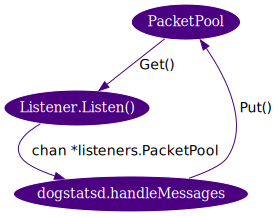

title: Golang performance optimization
class: animation-fade
layout: true

<!-- This slide will serve as the base layout for all your slides -->
.bottom-bar[
  {{title}}
]

---
class: impact
# {{title}}
## A Dogstatsd Journey
---
class: spacey
# Agenda
&nbsp;

.big[- Introduction to golang performance optimization

- Using a real-life case: Dogstatsd6

- We'll only touch the surface (pprof, expvar & bench)

- Hopefully make you want to try it yourself]
---
class: spacey
# What is Dogstatsd?

.big[- Our intake for **custom metrics** / events

- Comes bundled inside the agent

- Listens to UDP / UDS packets (text protocol)

- Client-side aggregation per 10 sec buckets

- **Throughput** was unsatisfactory]
---

# Agent5 limitations

.big[- **Single-threaded** python intake loop

- Parsing logic not optimised for **performance**

- Separate forwarder process introduces overhead]

--

## The golang rewrite will solve all of this

## 👋 &nbsp; kthxbai &nbsp; 👋

---

# Oh, how wrong we were

Max throughput benchmark (Azure Large, 4 vCPU, 80k pps incoming UDP load):
<br/><br/>

.col-2[
&nbsp;]
.col-4[
## 5.20.0
- 26K pps

- 1.0 CPU core

- 0.6% memory

- 26k pps/core]
--
.col-4[
## 6.0.0 beta5
- 33.7K pps

- 1.5 CPU cores

- 0.4% memory

- **22.4k pps/core**]

---

# In-situ profiling with pprof
&nbsp;

- Enable http endpoint: `import _ "net/http/pprof"`

- Directly use with <br/>`go tool pprof http://localhost:6060/debug/pprof/*`

- `curl` and store for offline use

- `go tool pprof` has text, svg and http (1.10+) outputs

---

# Available pprof endpoints

- `/debug/pprof/heap`: heap allocations

- `/debug/pprof/profile`: CPU profiling (30 seconds)

&nbsp;

- `/debug/pprof/trace?seconds=5`: execution tracer

- `/debug/pprof/block`: goroutine blocks *

- `/debug/pprof/mutex`: mutex contentions *

.right[\* requires [additional setup](https://golang.org/pkg/net/http/pprof/)]

---
class: fullscreensvg

<object type="image/svg+xml" data="pprofs/beta5/profile.svg">

---

# CPU profile

```
$ go tool pprof http://localhost:6060/debug/pprof/profile
(pprof) top -cum 15
Showing nodes accounting for 3.22s, 16.18% of 19.90s total
      flat  flat%   sum%        cum   cum%
*    0.06s   0.3%  1.31%      3.76s 18.89%  pkg/dogstatsd/listeners.(*UDPListener).Listen
         0     0%  1.31%      3.40s 17.09%  runtime.gcBgMarkWorker
     0.48s  2.41%  3.72%      3.31s 16.63%  runtime.gentraceback
*    0.06s   0.3%  4.02%      3.25s 16.33%  pkg/aggregator.(*BufferedAggregator).run
     0.01s  0.05%  4.07%      3.17s 15.93%  runtime.morestack
     0.04s   0.2%  4.27%      3.16s 15.88%  runtime.newstack
     1.67s  8.39% 12.66%      3.08s 15.48%  runtime.scanobject
     0.02s   0.1% 12.76%      3.06s 15.38%  runtime.copystack
     0.15s  0.75% 13.52%         3s 15.08%  runtime.gcDrain
         0     0% 13.52%      2.98s 14.97%  runtime.gcBgMarkWorker.func2
     0.41s  2.06% 15.58%      2.74s 13.77%  runtime.mallocgc
*    0.06s   0.3% 15.88%      2.54s 12.76%  pkg/dogstatsd.(*Server).handleMessages.func1
     0.02s   0.1% 15.98%      2.21s 11.11%  net.(*UDPConn).ReadFrom
```

---
count: false

# CPU profile

```
$ go tool pprof http://localhost:6060/debug/pprof/profile
(pprof) top -cum 15
Showing nodes accounting for 3.22s, 16.18% of 19.90s total
      flat  flat%   sum%        cum   cum%
     0.06s   0.3%  1.31%      3.76s 18.89%  pkg/dogstatsd/listeners.(*UDPListener).Listen
         0     0%  1.31%      3.40s 17.09%  runtime.gcBgMarkWorker
     0.48s  2.41%  3.72%      3.31s 16.63%  runtime.gentraceback
     0.06s   0.3%  4.02%      3.25s 16.33%  pkg/aggregator.(*BufferedAggregator).run
     0.01s  0.05%  4.07%      3.17s 15.93%  runtime.morestack
*    0.04s   0.2%  4.27%      3.16s 15.88%  runtime.newstack
     1.67s  8.39% 12.66%      3.08s 15.48%  runtime.scanobject
     0.02s   0.1% 12.76%      3.06s 15.38%  runtime.copystack
*    0.15s  0.75% 13.52%         3s 15.08%  runtime.gcDrain
         0     0% 13.52%      2.98s 14.97%  runtime.gcBgMarkWorker.func2
*    0.41s  2.06% 15.58%      2.74s 13.77%  runtime.mallocgc
     0.06s   0.3% 15.88%      2.54s 12.76%  pkg/dogstatsd.(*Server).handleMessages.func1
     0.02s   0.1% 15.98%      2.21s 11.11%  net.(*UDPConn).ReadFrom
```

---

# First diagnostics

### We are "wasting" 45 % of our allocated CPU time:

- 19% in the UDP intake (`UDPListener.Listen`)
- 16% in the aggregator (`BufferedAggregator.Run`)
- **16% spawning goroutines (`runtime.newstack`)**
- **15% in the GC (`runtime.gcDrain`)**
- **14% allocating heap memory (`runtime.mallocgc`)**
- 12% parsing messages (`Server.handleMessages.func1`)
- 8% on other things

---

# Go expvar memstats

`curl http://localhost:5000/debug/vars | jq .memstats`

.col-6[
```
"memstats":{
   "Alloc":3403328,
*  "TotalAlloc":31013281552,
   "Sys":16001272,
*  "Mallocs":75871543,
*  "Frees":75851538,
   "HeapAlloc":3403328,
   "HeapSys":11698176,
   "HeapIdle":6389760,
   "HeapInuse":5308416,
   "HeapReleased":0,
   "HeapObjects":20005,
...
   ```
]
.col-6[
```
   "StackInuse":884736,
   "StackSys":884736,
   "MSpanInuse":101080,
   "MSpanSys":180224,
   "GCSys":622592,
   "OtherSys":1143653,
   "NumGC":11467,
*  "GCCPUFraction":0.15341308345347093,
   "NextGC":6258320,
   "LastGC":1522926429117087347,
   "PauseTotalNs":24113172806,
   "NumForcedGC":0,
},
```
]

---

# Heap profiling

`go tool pprof $MODE http://localhost:6060/debug/pprof/heap`

- **Alloc size** influences the **frequency** of the GC runs:
  - `-inuse_space` : **current** heap use, in total size
  - `-alloc_space` : **total allocations** since start, in size

- **Alloc count** influences the **length** of the GC runs (more work to do):
  - `-inuse_objects` : **current** heap use, in object count
  - `-alloc_objects` : **total allocations** since start, in object count

---

# Heap profiling (beta5)

```
$ go tool pprof -alloc_space heap
(pprof) top
Showing nodes accounting for 12.98GB, 98.82% of 13.13GB total
Dropped 183 nodes (cum <= 0.07GB)
Showing top 10 nodes out of 19
      flat  flat%   sum%        cum   cum%
*  12.05GB 91.76% 91.76%    12.16GB 92.60%  pkg/dogstatsd/listeners.(*UDPListener).Listen
    0.29GB  2.22% 93.98%     0.29GB  2.22%  bytes.genSplit
    0.18GB  1.34% 95.33%     0.44GB  3.37%  pkg/dogstatsd.parseMetricPacket
    0.16GB  1.20% 96.53%     0.16GB  1.20%  bytes.NewBuffer (inline)
    0.08GB  0.58% 97.11%     0.08GB  0.58%  seelog.newLogFormattedMessage (inline)
    0.07GB  0.52% 97.63%     0.11GB  0.84%  net.(*UDPConn).readFrom
    0.06GB  0.49% 98.12%     0.14GB  1.07%  pkg/dogstatsd.(*Server).handleMessages
    0.05GB  0.36% 98.48%     0.29GB  2.19%  pkg/aggregator.generateContextKey
    0.04GB  0.34% 98.82%     0.09GB  0.69%  pkg/dogstatsd.parseTags
         0     0% 98.82%     0.22GB  1.69%  bytes.Split
```

---

# Read buffers

```go
func (l *UDPListener) Listen() {
  for {
    buf := make([]byte, l.bufferSize)
    n, _, err := l.conn.ReadFrom(buf)
...
    packet := &Packet{ Contents: buf[:n] }
    l.packetOut <- packet
  }
}
```

- One 8kB buffer allocated per incoming packet

- Parsed, then garbage-collected

- 25k packets/sec → **200 MB/sec of heap trash**

---

# Read buffers: reuse them!


.col-7[
**[#928 [dsd] reduce heap allocations in listeners](https://github.com/DataDog/datadog-agent/pull/928)**

Object reuse through a [sync.Pool](https://golang.org/pkg/sync/#Pool)

```go
 type Packet struct {
  buffer   []byte // Underlying buffer for data read
  Contents []byte // Contents (slice from buffer)
 }
```
- Scales up (`Get` returns `nil`) and down (GC)
- Make sure you don't bleed out **slices** before you `Put` the object back in the pool
]
.col-5[
<br/><br/><br/><br/>
.right[]
]

---

# Results (beta 6)


- **`memstats.GCCPUFraction ` : 1,37%**

- [CPU profiling](pprofs/beta6/profile.svg):
  - `runtime.gcDrain` down to 1.78%
  - `runtime.mallocgc` is still 8% → need to keep working on allocations

- [Alloc-space](pprofs/beta6/heap.svg): two main causes identified:
  - `dogstatsd.parseMetricMessage` / `bytes.Split`
  - `aggregator.run` / `generateContextKey`

---
class: fullscreensvg

<object type="image/svg+xml" data="pprofs/beta6/heap.svg">

---

# Aggregator context keys

- Used to group metric points per context (name + host + tags) for client-side aggregation
- `generateContextKey` called once per data point → `hot path`

###Current implementation:

- `metrics.MetricSample` → `string`

**`metric_name,tag1:value,tag2:value,...,host`**

- Using `bytes.Buffer` with size pre-computation for performance

---

```go
func generateContextKey(metricSample *metrics.MetricSample) string {
  // Pre-compute the size of the buffer we'll need, and allocate a buffer of that size
  bufferSize := len(metricSample.Name) + 1
  for k := range metricSample.Tags {
    bufferSize += len(metricSample.Tags[k]) + 1
  }
  bufferSize += len(metricSample.Host)
  buffer := bytes.NewBuffer(make([]byte, 0, bufferSize))

  sort.Strings(metricSample.Tags)
  // write the context items to the buffer, and return it as a string
  buffer.WriteString(metricSample.Name)
  buffer.WriteString(",")
  for k := range metricSample.Tags {
    buffer.WriteString(metricSample.Tags[k])
    buffer.WriteString(",")
  }
  buffer.WriteString(metricSample.Host)
  return buffer.String()
}
```

---

# Benchmark

```go
import "testing"

func BenchmarkCurrent(b *testing.B) {
  for n := 0; n < b.N; n++ {
    _ = generateContextKey(testSample)
  }
}
```
--

```
$ go test -bench=BenchmarkCurrent -benchmem ./bench/contextkeys/
goos: darwin
goarch: amd64
BenchmarkCurrent-4     3000000         422 ns/op       560 B/op        4 allocs/op
PASS
ok    _/Users/xaviervello/git/decks/201802-internal-dsd-optim/bench/contextkeys 1.766s
```
---

# Benchmark: per code line

- Stack / heap repartition is not intuitive (see [escape analysis](http://www.agardner.me/golang/garbage/collection/gc/escape/analysis/2015/10/18/go-escape-analysis.html))
- Better **measure** than guess

```
$ go test -bench=BenchmarkCurrent -memprofile=mem ./bench/contextkeys/
*$ go tool pprof --top --alloc_objects --lines mem
Type: alloc_objects
Time: Feb 21, 2018 at 4:11pm (CET)
Showing nodes accounting for 15925594, 100% of 15925610 total
Dropped 13 nodes (cum <= 79628)
      flat  flat%
   4185388 26.28%  bytes.NewBuffer src/bytes/buffer.go:449 (inline)
   4081685 25.63%  bench/contextkeys/current_test.go:20 (make([]byte, 0, bufferSize)
   3922855 24.63%  bytes.(*Buffer).String src/bytes/buffer.go:66 (inline)
   3735666 23.46%  sort.Strings libexec/src/sort/sort.go:314
```

---

# Use binary hash instead of string

```go
func NewHandle(metricSample *metrics.MetricSample) Handle {
  mmh := mmh3.HashWriter128{}  // thanks metrics-intake!
  sort.Strings(metricSample.Tags)
  io.WriteString(&mmh, metricSample.Name)
  io.WriteString(&mmh, ",")
...
  io.WriteString(&mmh, metricSample.Host)
  var h Handle  // [20]byte
  binary.LittleEndian.PutUint32(h[0:], 0)
  mmh.Sum(h[4:4])
  return h
}
```

```
$ go test -bench=. -benchmem ./bench/contextkeys/
BenchmarkCurrent-4                         548 ns/op       560 B/op        4 allocs/op
*BenchmarkHandle-4                          835 ns/op        80 B/op        2 allocs/op
```

---

# Reuse hasher

```go
func init() {
  mmh = new(mmh3.HashWriter128)  // used a sync.Pool in real code
}

func NewHandleReuse(metricSample *metrics.MetricSample) Handle {
  mmh.Reset()
...
  var h Handle
  binary.LittleEndian.PutUint32(h[0:], 0)
  mmh.Sum(h[4:4])
  return h
}
```

```
BenchmarkCurrent-4                         548 ns/op       560 B/op        4 allocs/op
BenchmarkHandle-4                          835 ns/op        80 B/op        2 allocs/op
*BenchmarkHandleReuse-4                     856 ns/op        32 B/op        1 allocs/op
```

---

# Interface checks don't come cheap

```go
func NewHandleReuseNoIface(metricSample *metrics.MetricSample) [16]byte {
  mmh.Reset()

  mmh.WriteString(metricSample.Name)
  mmh.WriteString(",")
...
}
```

Calling `mmh.WriteString(data)` instead of `io.WriteString(mmh, data)`

```
BenchmarkCurrent-4                         548 ns/op       560 B/op        4 allocs/op
BenchmarkHandle-4                          835 ns/op        80 B/op        2 allocs/op
BenchmarkHandleReuse-4                     856 ns/op        32 B/op        1 allocs/op
*BenchmarkHandleReuseNoIface-4              375 ns/op        32 B/op        1 allocs/op
```

---
# In-place sorting

```go
func NewHandleReuseNoIfaceSelection(metricSample *metrics.MetricSample) [16]byte {
  mmh.Reset()
  if len(metricSample.Tags) < 15 {
    selectionSort(metricSample.Tags)
  } else {
    sort.Strings(metricSample.Tags)  // quicksort
  }
...
}
```
```
BenchmarkCurrent-4                         548 ns/op       560 B/op        4 allocs/op
BenchmarkHandle-4                          835 ns/op        80 B/op        2 allocs/op
BenchmarkHandleReuse-4                     856 ns/op        32 B/op        1 allocs/op
BenchmarkHandleReuseNoIface-4              375 ns/op        32 B/op        1 allocs/op
BenchmarkHandleReuseNoIfaceBubble-4        410 ns/op         0 B/op        0 allocs/op
*BenchmarkHandleReuseNoIfaceSelection-4     303 ns/op         0 B/op        0 allocs/op
```

---
class: width70

# Aggregator context keys: recap

**[#950 [agg] move contextKeys to 128bit Murmur3 hashes](https://github.com/DataDog/datadog-agent/pull/950)**

- 560 B/point × 25k points/sec = **14 MB/sec**
- **30% faster** on context lookups
- 128bit hash is overkill, we stayed on the safe side (collision risk)


---

# Packet parsing

- Heavy use of `bytes.Split`, that allocates `[][]byte` **arrays**
- Replacement by a homegrown method returning two `[]byte` **slices**

```go
func split2(slice, sep []byte) ([]byte, []byte) {
  sepIndex := bytes.Index(slice, sep)
  if sepIndex == -1 {
    return slice, nil
  } else {
    return slice[:sepIndex], slice[sepIndex+1:]
  }
}
```

**[#951 [dsd] optimize parsing logic for performance](https://github.com/DataDog/datadog-agent/pull/951)**

---

# Moar benchmarks

```
$ go test -bench=. -benchmem ../../bench/parsing

BenchmarkNextMessageCurrent-4        508 ns/op       272 B/op        5 allocs/op
BenchmarkNextMessageScanner-4       1662 ns/op      4224 B/op        3 allocs/op
BenchmarkNextMessageScanLines-4      108 ns/op        80 B/op        1 allocs/op
```

`bufio.Scanner` is expensive, `bufio.ScanLines` is great for newlines

```
BenchmarkParseMetricCurrent-4        798 ns/op       328 B/op        8 allocs/op
BenchmarkParseMetricSplit2-4         362 ns/op       200 B/op        5 allocs/op

BenchmarkParseTagsCurrent-4          398 ns/op       160 B/op        5 allocs/op
BenchmarkParseTagsSplit2-4           319 ns/op        80 B/op        4 allocs/op
```

Remaining allocations are `string`

---

# Goroutines don't come cheap

- We were spawning one parsing goroutine per packet
- Transition to a fixed number of goroutines reading on a channel

**[#952 [dsd] use a fixed number of parsing workers](https://github.com/DataDog/datadog-agent/pull/952)**

```go
packetChannel := make(chan *listeners.Packet, 100) // Pointers are cheap to store

// Keep 1 CPU for UDP intake, 1 for aggregator + forwarder
workers := runtime.GOMAXPROCS(-1) - 2
if workers < 2 {
    workers = 2
}

for i := 0; i < workers; i++ {
    go parsingWorker(packetChannel, metricOut, eventOut, serviceCheckOut)
}
```

---

# Baseline pprof comparaison

- **+70%** throughput (35k → 59k pps)

```
*$ go tool pprof -base pprofs/beta5/profile pprofs/beta7/profile
*Showing nodes accounting for -5.29s, 21.07% of 25.11s total
(pprof) top -cum 30
      flat  flat%   sum%        cum   cum%
    -0.04s  0.16%  2.87%     -3.16s 12.58%  runtime.newstack
    -0.15s   0.6%  3.54%     -2.92s 11.63%  runtime.gcDrain
*   -0.06s  0.24% 10.08%     -2.54s 10.12%  pkg/dogstatsd.(*Server).handleMessages.func1
    -0.31s  1.23% 11.31%     -2.34s  9.32%  runtime.mallocgc
    -0.05s   0.2% 11.51%     -2.29s  9.12%  pkg/aggregator.(*BufferedAggregator).run
    -0.04s  0.16% 11.67%     -2.27s  9.04%  pkg/dogstatsd/listeners.(*UDPListener).Listen
    -0.22s  0.88% 12.62%     -1.65s  6.57%  pkg/dogstatsd.parseMetricPacket
*    0.10s   0.4% 15.41%      1.10s  4.38%  pkg/dogstatsd.(*Server).worker
    -0.01s  0.04% 20.59%     -0.88s  3.50%  pkg/aggregator.(*BufferedAggregator).addSample
    -0.10s   0.4% 20.99%     -0.88s  3.50%  pkg/dogstatsd.(*Server).handleMessages
...
```
---

# What's next?


```
$ go tool pprof pprofs/beta7/profile
      flat  flat%   sum%        cum   cum%
*    0.02s  0.38%  0.38%      1.49s 28.60%  pkg/dogstatsd/listeners.(*UDPListener).Listen
*        0     0%  2.30%      1.10s 21.11%  net.(*UDPConn).ReadFrom
*    0.01s  0.19%  2.88%      1.03s 19.77%  runtime.mcall
     0.10s  1.92%  2.30%      1.10s 21.11%  pkg/dogstatsd.(*Server).worker
     0.01s  0.19%  3.84%      0.96s 18.43%  pkg/aggregator.(*BufferedAggregator).run
...
```
&nbsp;
- Syscalls are expensive (cost ~1.5x from C)

- Client-side buffering (several metrics / packet) to reduce them

---

# Client-side buffering

- 50 metrics / packet
- `c5-xlarge` instances (4 vCPU) on dedicated host
- Sender VM is limiting (10 python sender loops, loadavg > 9)

.col-4[
## 5.23.0
- 149k pps

- 1.0 CPU core

- 149k pps/core]
.col-4[
## 6.0.0 beta5
- 388k pps

- 3.4 CPU cores

- 114k pps/core]
.col-4[
## 6.0.0 beta7
- 580k pps

- 1.86 CPU cores

- **312k pps/core**]

---

# Take away
.big[- **Measure, measure, then measure some more**

- `golang` tooling excellent for this

- Garbage collection is convenient, but comes at a cost

- CPU / memory tradeoffs: what is limiting now?

- Favor the (great) stdlib, know when not to
]

---
class: impact

# Questions?

---
class: impact

# Thanks!

## github.com/xvello/decks
## (benchmarks, pprofs)
